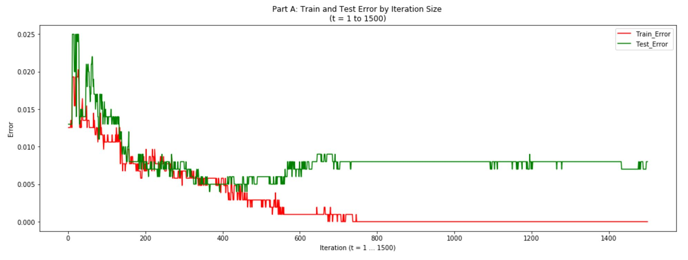
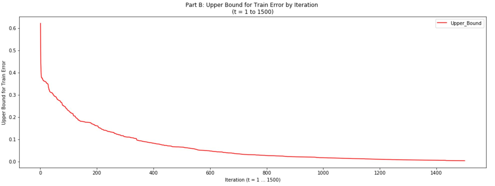
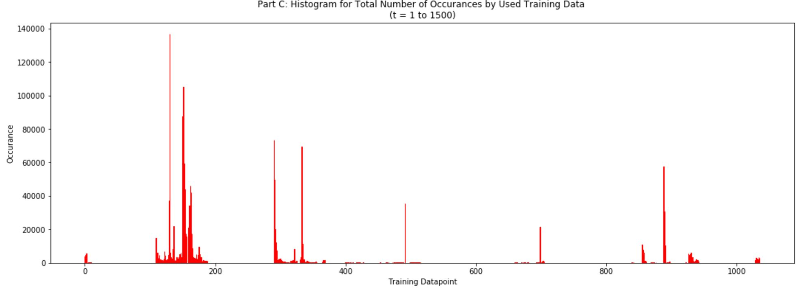
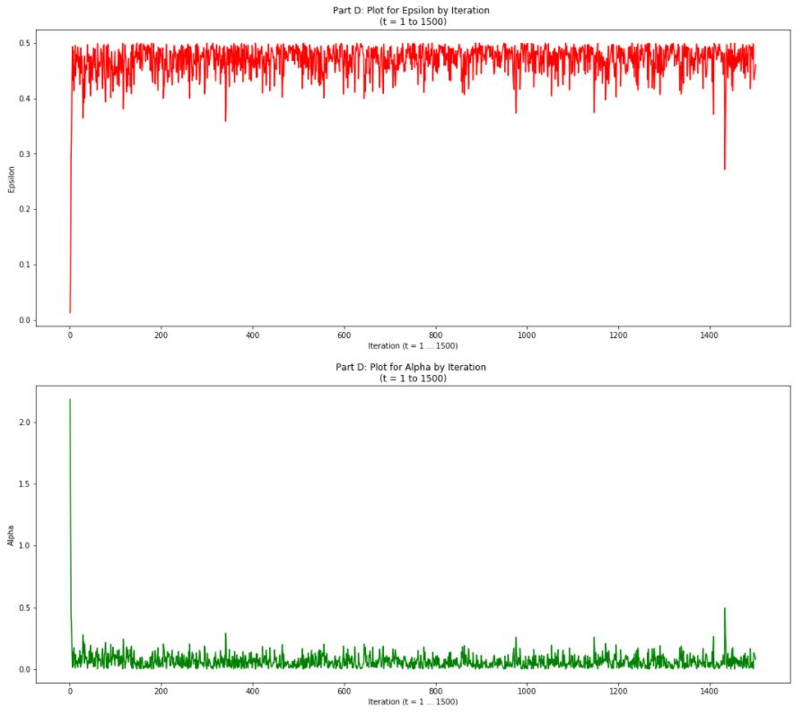

# Least Squares based Boosting Classifier Algorithm

Least Squares classifier performs least squares linear regression treating the +/-1 labels as real-valued responses. However, this classifier is not much effective, so boosting it can give good results.

Approach: A Bootstrap method is used, where each bootstrap set B_t is the size of the training set. If error e_t >0.5, one can simply change the sign of the regression vector w (including the intercept w_0) and recalculate the error.

## Data
Information about the data used for this problem can be found here: https://archive.ics.uci.edu/ml/datasets/Occupancy+Detection+
Note: The intercept dimension has not been included in the features provided, so I added a dimension equal to 1.

## Parts

#### Part A

The implemented boosted LS classifier is ran for T = 1,500 rounds. The training and testing error of f_boost(t) for t = 1, ..., T is visualized below:

  

#### Part B

Upper bound on the training error as a function of t is shown below:

  

#### Part C

A histogram of the total number of times each training data point was selected by the bootstrap method across all rounds is plotted. In other words, sum the histograms of all B_t below:

  

#### Part D

e_t and a_t as a function of t are shown below:

  

