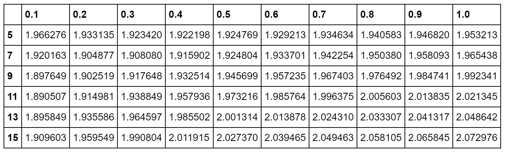
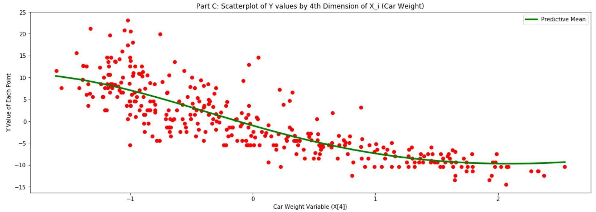

# Gaussian Process Model for Regression

Gaussian process treats a set of N observations (x1,y1) .. (xN,yN), with x_i in R^d and y_i in R, as being generated from a multivariate Gaussian distribution as follows:
           <insert formula>
Here, y is an N-dimensional vector of outputs and K is an N x N kernel matrix. For this problem, I used the Guassian kernal indicated above. For making predictions, for a new y' given x', which was Gaussian with mean m(x') and variance Sigma(x').

## Data
Information about the original data used for this problem can be found here: https://archive.ics.uci.edu/ml/datasets/Auto+MPG

Note: Car name and origin features are removed. The remaing data are scaled.

## Parts

#### Part A

Gaussian process is implemented and new predictions on test data are made.

#### Part B

For b {5,7,9,11,13,15} and sigma2 {.1,.2,.3,.4,.5,.6,.7,.8,.9,1} - so 60 total pairs (b,sigma2) - RMSE are calculated on the 42 test points. The mean of Gaussian process at the test point was used as prediction. RMSE table is shown below:

  

#### Part C

Algorithm is re-run by using only the 4th dimension of x_i (car weight). For b = 5 and sigma2 = 2, a scatter plot of the data (x[4] vs. y for each point) is drawn. The same plot is overlapped with a solid line as predictive mean of the Gaussian process at each point in the training.

  

